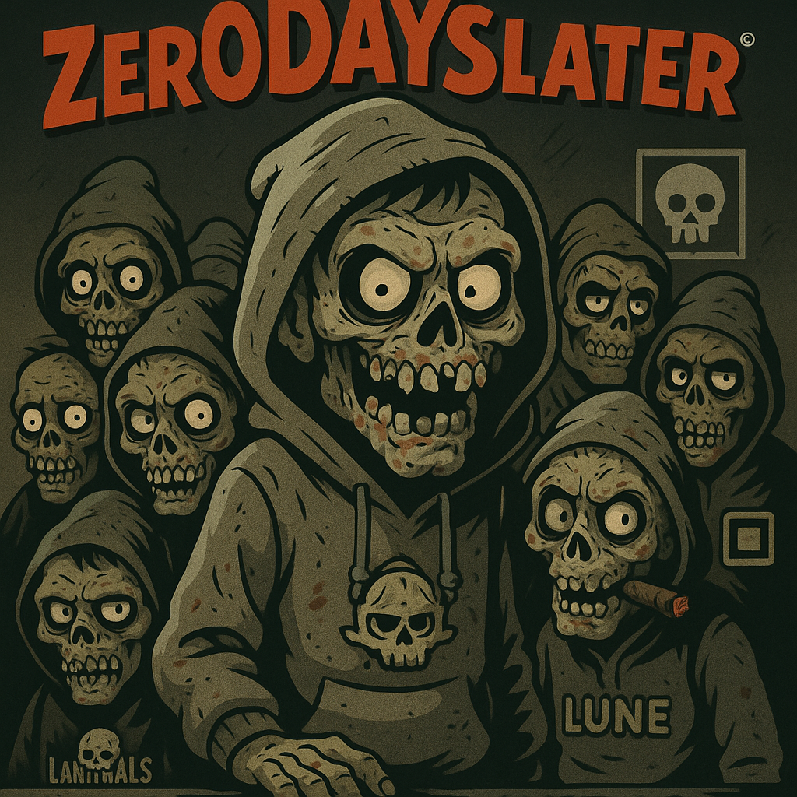

# zer0DAYSlater

<p align="center">
  
</p>

[](https://github.com/GnomeMan4201/zer0DAYSlater/actions/workflows/python-ci.yml)
[](https://github.com/GnomeMan4201/zer0DAYSlater/actions/workflows/docs.yml)
[](LICENSE)

## Overview

*- Exploit automation toolkit*

## Features

- Exploit automation toolkit
- Zero-day vulnerability scanner
- Automated payload deployment

## Demo


## Setup

```bash
python -m venv .venv
source .venv/bin/activate
pip install -r requirements.txt
```

## Usage

*Explain how to use zer0DAYSlater here.*

## Contributing

Please see [CONTRIBUTING.md](CONTRIBUTING.md).

## License

MIT License © 2025 Your Name
