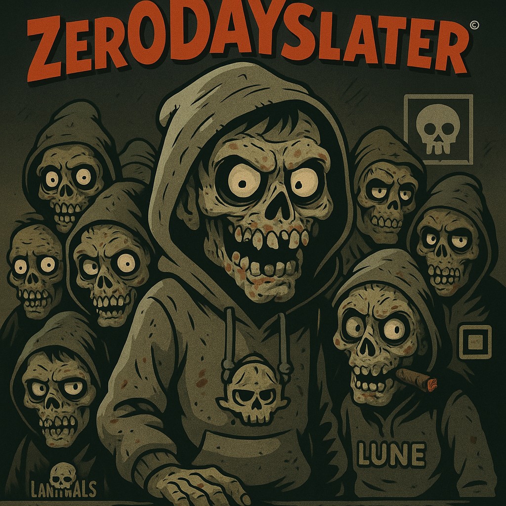

<p align="center">
[](https://github.com/GnomeMan4201/zer0DAYSlater/actions/workflows/ci.yml)

  
</p>

# zer0DAYSlater

**Post-exploitation framework — natural language campaign scheduling, multi-channel C2, process cloaking, and adaptive persistence.**

[](LICENSE)
[](#)

---

zer0DAYSlater is an operator-centric post-exploitation framework built around a natural language command interface. Tell it what to do in plain English — "exfil user profiles after midnight", "persist across reboot, low noise" — and it parses intent into structured action objects, schedules execution, and dispatches to the appropriate module.

C2 runs across DNS, HTTPS, MQTT, and ICMP with automatic channel fallback. Agents cloak themselves as legitimate system processes. Everything is operator-driven from a live TUI dashboard.

---

## How it works
```
operator types natural language command
    ↓
llm_command_parser — extract action, filters, schedule
    ↓
wait_for_schedule — hold until execution window
    ↓
dispatch to module (exfil / persist / lateral / cloak)
    ↓
c2_mesh_agent — encrypted peer-to-peer result reporting
    ↓
tui_dashboard — live session state
```

The command parser understands time expressions ("after midnight", "after 3pm"), target filters ("user profiles", "credentials"), and action types ("exfil", "persist", "move"). No fixed command syntax — it reads intent.

---

## Architecture
```
zer0DAYSlater/
├── omega_campaign.sh           campaign entry point
├── llm_command_parser.py       NL → structured action objects + scheduler
├── tui_dashboard.py            live operator session dashboard
├── memory_loader.py            in-memory payload execution without disk touch
├── process_doppelganger.py     process name spoofing via prctl
├── process_cloak.py            process identity masking
├── evasion_win.py              Windows-side evasion + sandbox detection
├── persistence.py              multi-vector persistence binding
├── lateral.py                  authenticated lateral movement
├── c2_mesh_agent.py            peer-to-peer mesh agent with mTLS
├── peer_auth.py                symmetric key peer verification
└── proxy_fallback_check.py     C2 channel fallback logic
```

**C2 channels:** DNS · HTTPS · MQTT · ICMP

---

## Install
```bash
git clone https://github.com/GnomeMan4201/zer0DAYSlater.git
cd zer0DAYSlater
python3 -m venv .venv && source .venv/bin/activate
pip install -r requirements.txt
./install_omega.sh
./omega_campaign.sh
```

---

## Legal

For authorized red team operations and security research in controlled environments only. Unauthorized use is prohibited.

---

*zer0DAYSlater // badBANANA research // GnomeMan4201*
