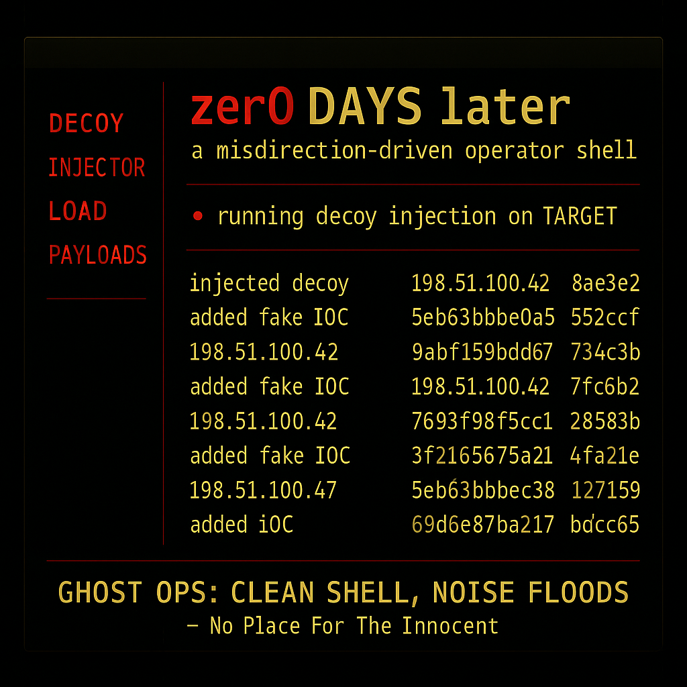

<h3 align="center"><code>A MISDIRECTION-DRIVEN OFFENSIVE TOOLKIT FOR COGNITIVE DISRUPTION</code></h3>

<p align="center">
  <b>zer0 DAYS later</b> is a psychological deception toolkit for red teamers, APT operators, and adversary simulation artists.<br>
  It hijacks the mind of defenders — flooding systems with false leads, injected IOCs, decoys, and noise.<br>
  Built for GitOps, CI/CD pipelines, and post-exfil ghostwalks.
</p>

<p align="center">
  
</p>

---

## [ PHILOSOPHY ]

Traditional defense is overrun. Speed and misdirection now matter more than brute force.  
`zer0 DAYS later` is built for one purpose: **to manipulate perception**.

Every artifact is intentional. Every decoy is weaponized.  
This is not just post-exploitation — it’s cognitive warfare embedded directly into the operational flow.

---

## [ FEATURES ]

✅ Misdirection-first deception strategy  
✅ Drop-in GitOps deployment (CI/CD-ready)  
✅ Injects fake IOCs, decoy credentials, poisoned indicators  
✅ Tripwire logs + behavioral scanners to trace interaction  
✅ PDF report generation + enriched threat attribution  
✅ Clean operator shell while noise floods the system  
✅ LLM-powered payload expansion system (v2)  
✅ Full modular CLI w/ themed UX (LANimals-inspired)  

---

## [ MODULES ]

| Module                  | Description                                                  |
|-------------------------|--------------------------------------------------------------|
| `recon_engine.py`       | Passive recon using Shodan, WHOIS, VirusTotal               |
| `signal_injector.py`    | Injects fake IOCs and noisy decoy artifacts                  |
| `behavioral_scanner.py` | Flags suspicious patterns like `eval`, `subprocess`, etc.    |
| `threat_attributor.py`  | Enriches indicators with attacker fingerprint data           |
| `tripwire_monitor.py`   | Detects interaction with bait and logs hits                  |
| `reportlab_integration` | Auto-generates PDFs w/ IOC activity & attribution summary    |
| `payload_chain_llm.py`  | (v2) LLM-based chaining for contextual payload expansion     |
| `zerodayslater-ui.py`   | Main CLI launcher (LANimals-style shell)                     |

---

## [ QUICKSTART ]

```bash
git clone https://github.com/GnomeMan4201/zer0DAYSlater.git
cd zer0DAYSlater
chmod +x install.sh
./install.sh
python3 zerodayslater-ui.py

## [ MOCKUPS ]

> Simulated terminal sessions of zer0DAYSlater GitOps attacks:

- [Threat Injection Shell](docs/mockups/zer0DAYSlater_terminal_mockup.txt)
- [Session Replay View](docs/mockups/zer0DAYSlater_session_replay_mockup.txt)

## [ MOCKUP VIEWER – GitHub Pages ]

Browse formatted mockups directly on GitHub Pages:

- [Threat Injection Shell](https://gnomeman4201.github.io/zer0DAYSlater/mockups/md/zer0DAYSlater_terminal_mockup)
- [Session Replay View](https://gnomeman4201.github.io/zer0DAYSlater/mockups/md/zer0DAYSlater_session_replay_mockup)
